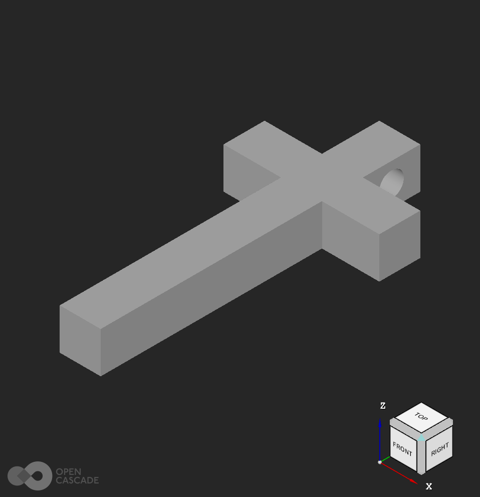
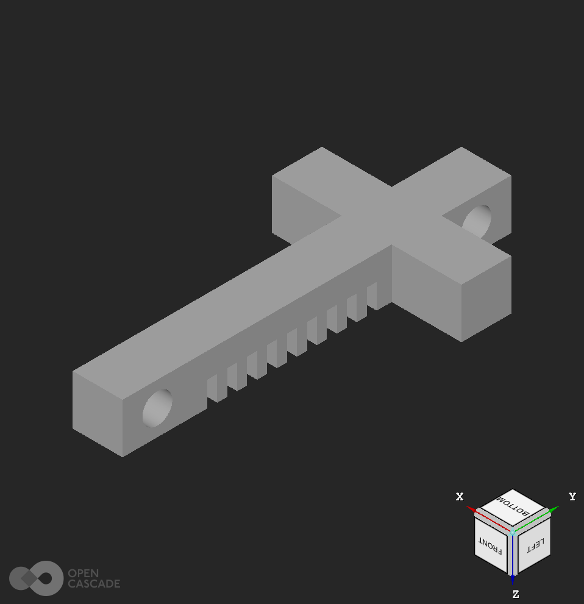
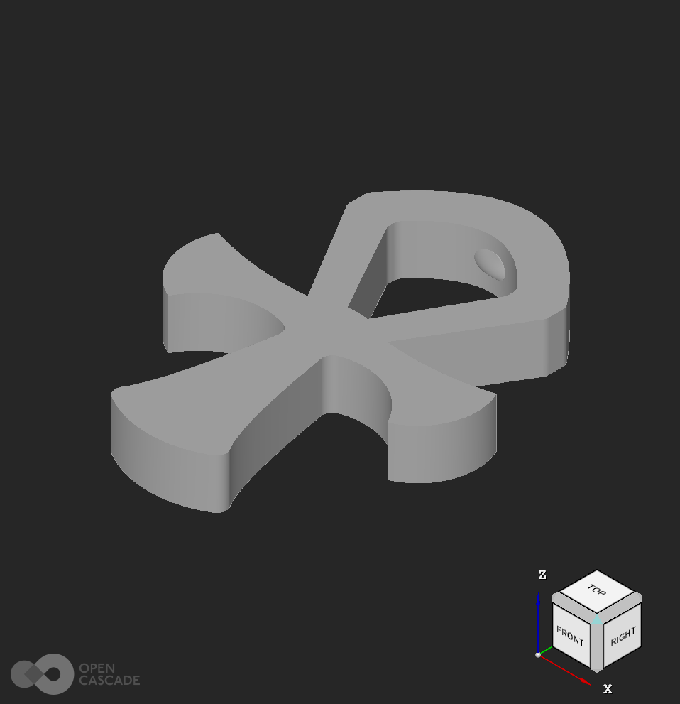

# open-charms
### Open source [FFF](https://en.wikipedia.org/wiki/Fused_filament_fabrication)/FDM printable jewelry.

Cross

A cross that can be worn as a pendant.

Cross-2

A flexible cross that can be worn as a bracelet. (Print in TPU)

Ankh

An ankh that can be worn as a pendant.